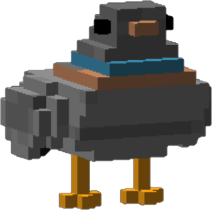
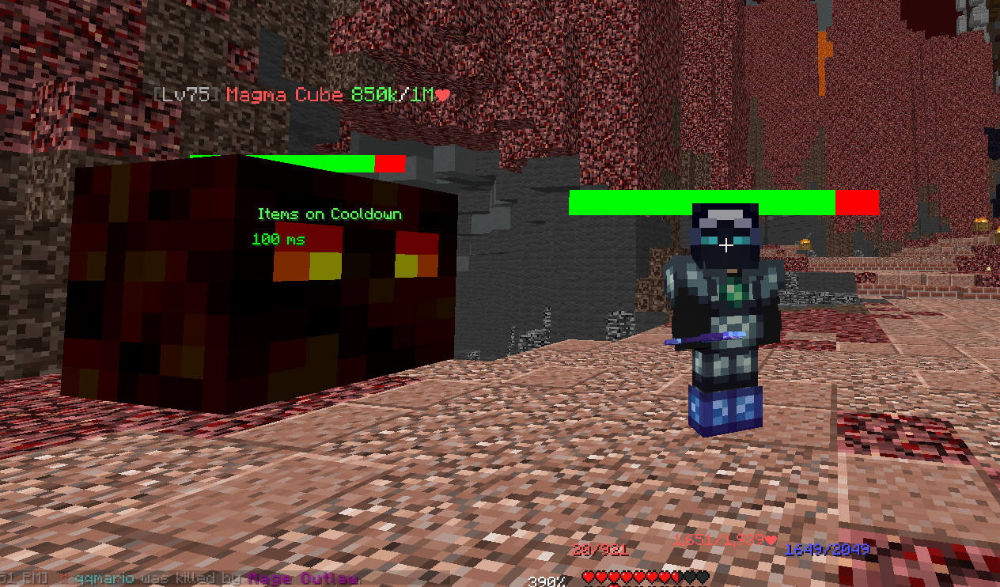
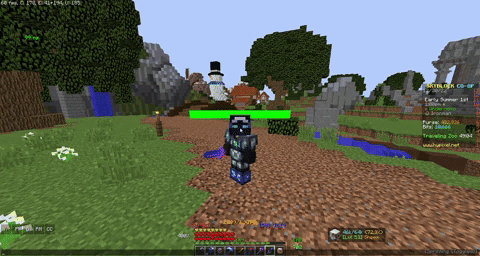

# Pigeon
A Minecraft mod with useful client-side features!
These features are mainly targeting the Minecraft server "Hypixel," gamemode "Skyblock."

  
*Look at this cute bird.*  
*You want it? Get this mod!*  

Features

## Features
- Chat bubbles in Hypixel only
- Type text emoticons in chat
- Rename your pet in Hypixel Skyblock (a little glitchy)
- A GUI of items' abilities.
  - Recommended to use a Hypixel Skyblock texture pack for this feature.
- A latency counter that shows your ping.
  - Works on Hypixel gamemodes! (Might be slightly inaccurate).
### Experimental features
- Dungeon animations
  - Only Healer's Wish ability is available right now.
- A notifier of when to use the Fire freeze staff on The Professor.
- Ferocity animations.
- Animation that makes Voidgloom Seraph hold a shield in hits phase.
- Health bars  
  - Known bug where player health doesn't update until the player moves.
  - THIS ONLY WORKS IN SKYBLOCK ONLY! Don't worry about unfair advantages in PVP gamemodes.

Commands

## Commands
- /pigeonconfig for the config GUI.
- /killallmoddedentities to destroy fake entities entities nearby.
  - Mainly used if there is a problem with too many entities.

## Notable features
Health Bars  
  
Chat Bubbles  
  
  
